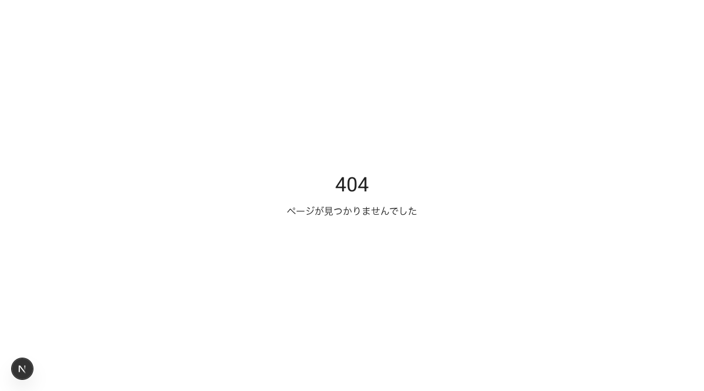

# アカウント詳細管理

自分のアカウント情報の確認方法、ユーザー名の変更、パスワードの変更手順を説明します。

## アカウント詳細管理画面へのアクセス

1. ダッシュボードにログインする
2. サイドバーメニューの「アカウント詳細管理」をクリックする
3. アカウント詳細管理画面が表示される

## アカウント情報の確認

アカウント詳細管理画面では、自分のアカウントに関する以下の情報を確認できます。

- **ユーザー名**: 現在設定されている表示名
- **権限**: 「管理者」または「利用者」
- **エリア設定**: アクセスが許可されているエリアの一覧

## ユーザー名の変更

表示名として使用するユーザー名を変更する手順です。

1. アカウント詳細管理画面の「ユーザー名」欄に新しいユーザー名を入力する
2. 「変更」ボタンをクリックする
3. ユーザー名が更新される

## パスワードの変更

現在のパスワードを新しいパスワードに変更する手順です。

1. 「現在のパスワード」欄に現在使用しているパスワードを入力する
2. 「新しいパスワード」欄に変更後のパスワードを入力する
3. 「新しいパスワード（再入力）」欄に同じパスワードをもう一度入力する
4. 「変更」ボタンをクリックする
5. パスワードが更新される

## エラーメッセージと対処方法

パスワード変更時に以下のエラーが表示される場合があります。

### 現在のパスワードと新しいパスワードが同一の場合

現在のパスワードと同じパスワードを新しいパスワードとして入力すると、エラーメッセージが表示されます。

- **対処方法**: 現在のパスワードとは異なるパスワードを「新しいパスワード」欄に入力してください

### 新しいパスワードと再入力が一致しない場合

「新しいパスワード」と「新しいパスワード（再入力）」の入力内容が一致しない場合、エラーメッセージが表示されます。

- **対処方法**: 「新しいパスワード」欄と「新しいパスワード（再入力）」欄に同じパスワードを正確に入力してください
