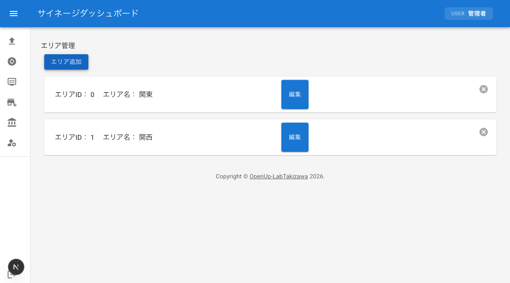
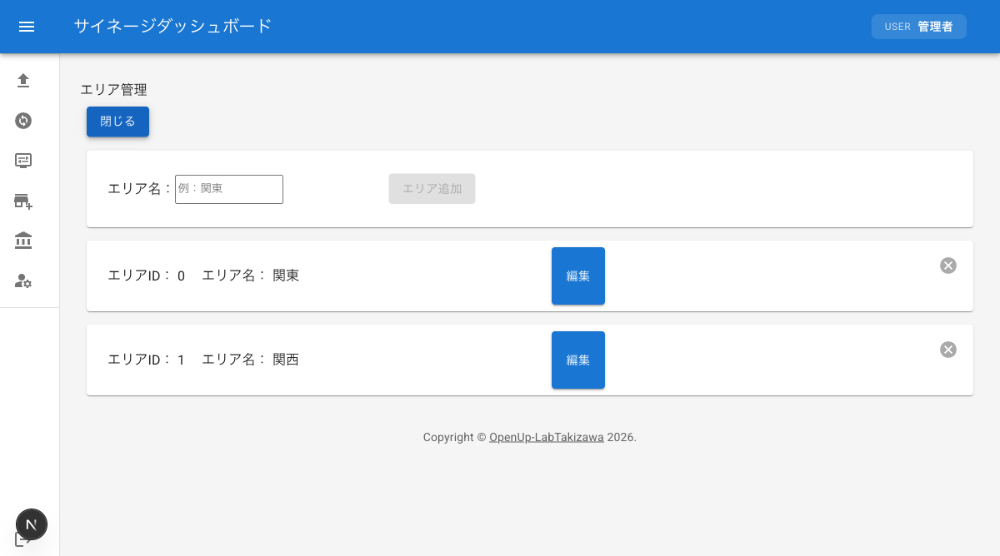

# エリア管理

エリアの追加・編集・削除方法を説明します。エリア管理は管理者のみが利用できる機能です。

:::tip
エリア管理メニューは管理者権限を持つユーザーにのみ表示されます。メニューが表示されない場合は、管理者にお問い合わせください。
:::

## エリア管理画面へのアクセス

1. ダッシュボードにログインする
2. サイドバーメニューの「エリア管理」をクリックする
3. エリア管理画面が表示され、登録済みのエリア一覧が表示される

各エリアには「エリアID」と「エリア名」が表示されます。

## 新しいエリアの追加

新しいエリアを追加する手順です。

1. エリア管理画面の「エリア追加」ボタンをクリックする
2. エリア追加フォームが表示される
3. 「エリア名」欄にエリア名を入力する（例：関東）
4. 「エリア追加」ボタンをクリックする
5. エリアが追加される

エリア名が未入力の場合、「エリア追加」ボタンは無効になります。追加フォームを閉じるには「閉じる」ボタンをクリックしてください。

## エリア名の編集

既存エリアのエリア名を変更する手順です。

1. 編集したいエリアの「編集」ボタンをクリックする
2. エリア名の入力欄が表示される
3. 新しいエリア名を入力する
4. 「編集」ボタンをクリックして変更を確定する

編集をキャンセルする場合は「閉じる」ボタンをクリックしてください。

## エリアの削除

不要なエリアを削除する手順です。削除したエリアは元に戻せないため、慎重に操作してください。

1. 削除したいエリアの×ボタン（右上）をクリックする
2. エリアが削除される

## 重複するエリア名のエラー

エリアの追加または編集時に、既に登録されているエリア名と同じ名前を入力すると、エラーダイアログが表示されます。

- **エラーメッセージ**: 「エリア名が他のエリアと重複しています」

### 対処方法

1. エラーダイアログを閉じる
2. 他のエリアと重複しない別のエリア名を入力する
3. 再度「エリア追加」ボタンまたは「編集」ボタンをクリックする
