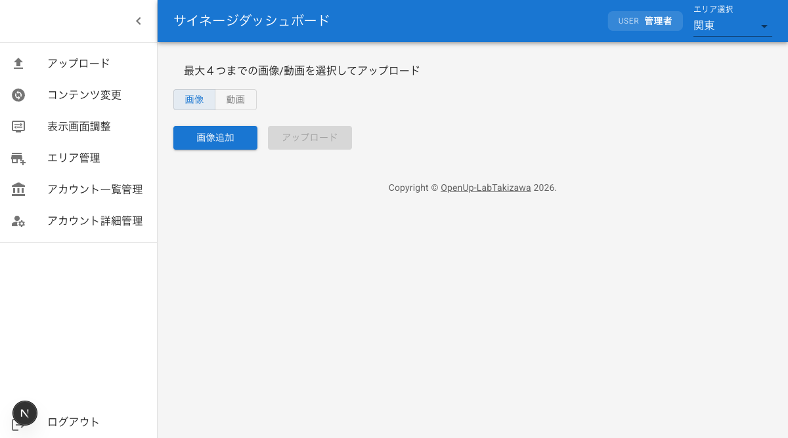

# ダッシュボード共通操作

ダッシュボードの各画面で共通して使用する操作方法を説明します。サイドバーメニューの開閉、ヘッダーバーのユーザー名確認、エリア選択、ユーザー権限によるメニューの違い、エラーダイアログの操作について記載しています。

## サイドバーメニューの開閉操作

ダッシュボードの左側にはサイドバーメニューがあり、各機能画面へ移動できます。サイドバーは開閉が可能です。

### サイドバーを開く

1. ヘッダーバー左端のメニューアイコン（☰）をクリックする
2. サイドバーが展開され、メニュー項目のテキストが表示される

### サイドバーを閉じる

1. サイドバー上部の左矢印アイコン（＜）をクリックする
2. サイドバーが縮小され、アイコンのみの表示になる

サイドバーが閉じた状態でも、アイコンをクリックすることで各画面へ移動できます。

## ヘッダーバーに表示されるユーザー名の確認

ログイン中のユーザー名は、ヘッダーバーに表示されます。

1. ヘッダーバーの右側を確認する
2. 「USER」ラベルの横に、現在ログインしているユーザー名が表示されている

表示されているユーザー名が正しいことを確認してください。ユーザー名を変更したい場合は、[アカウント詳細管理](/account-setting)から変更できます。

## エリア選択ドロップダウンの操作方法

以下の画面では、ヘッダーバーにエリア選択ドロップダウンが表示されます。

- **アップロード画面**
- **コンテンツ変更画面**
- **表示画面調整画面**

操作対象のエリアを切り替える手順です。

1. ヘッダーバー右側の「エリア選択」ドロップダウンをクリックする
2. 表示されるエリア一覧から、操作対象のエリアを選択する
3. 選択したエリアがドロップダウンに表示されていることを確認する
4. 画面の内容が選択したエリアのデータに切り替わる

エリアが未設定の場合、ドロップダウンには「設定なし」と表示され、選択操作はできません。エリアの設定については管理者にお問い合わせください。

## 管理者ユーザーと一般利用者のメニュー項目の違い

ログインしているユーザーの権限によって、サイドバーに表示されるメニュー項目が異なります。

### 全ユーザー共通のメニュー項目

すべてのユーザーに表示されるメニュー項目です。

- **アップロード**: コンテンツのアップロード画面
- **コンテンツ変更**: コンテンツの並び替え・表示切替・削除画面
- **表示画面調整**: サイネージ表示のサイズ・位置調整画面
- **アカウント詳細管理**: 自分のアカウント情報の確認・変更画面
- **ログアウト**: ダッシュボードからログアウト

### 管理者ユーザーのみ表示されるメニュー項目

管理者権限を持つユーザーには、上記に加えて以下のメニュー項目が表示されます。

- **エリア管理**: エリアの追加・編集・削除画面
- **アカウント一覧管理**: ユーザーアカウントの作成・編集・削除画面

一般利用者のサイドバーには「エリア管理」と「アカウント一覧管理」は表示されません。

## エラーダイアログの確認方法と閉じ方

操作中にエラーが発生すると、画面上にエラーダイアログが表示されます。

### エラーダイアログの内容を確認する

エラーダイアログには以下の情報が表示されます。

- **エラーメッセージ**: 発生したエラーの内容（赤字で表示）
- **対象箇所**: エラーが発生した操作や入力項目

表示された内容を確認し、エラーの原因を把握してください。

### エラーダイアログを閉じる

1. エラーダイアログの外側（背景部分）をクリックする
2. ダイアログが閉じ、元の画面に戻る

エラーダイアログを閉じた後、エラーの原因を修正してから操作をやり直してください。
