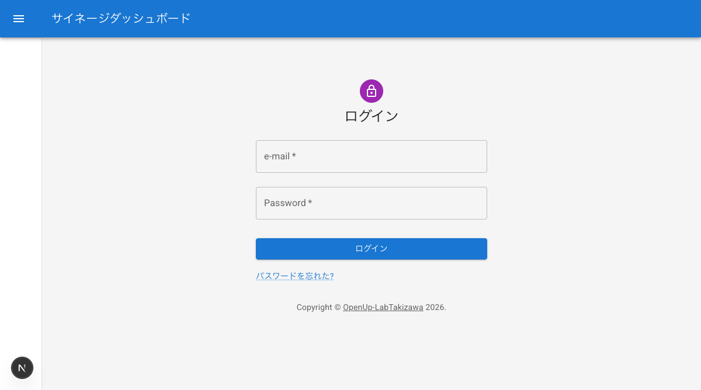
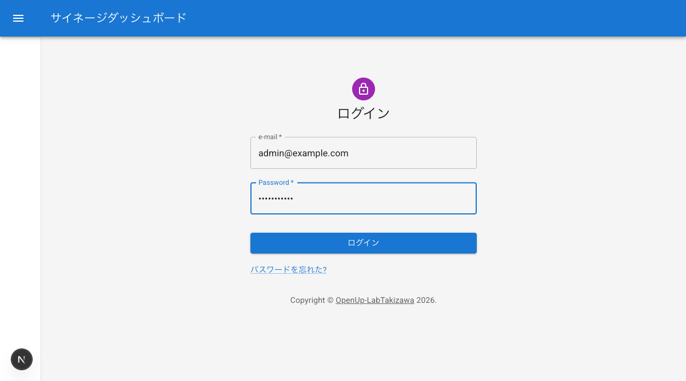

# ログインと認証

ダッシュボードへのログイン・ログアウト手順、初回ログイン時のパスワード再設定、トラブル時の対処方法を説明します。

## ログイン画面へのアクセス

ブラウザで以下の URL にアクセスすると、ダッシュボードのログイン画面が表示されます。

```
/dashboard/login
```



## ログイン手順

メールアドレスとパスワードを使用してダッシュボードにログインします。

1. ログイン画面で「メールアドレス」欄にメールアドレスを入力する
2. 「パスワード」欄にパスワードを入力する
3. 「ログイン」ボタンをクリックする
4. 認証に成功すると、ダッシュボードのトップページに遷移する



## 初回ログイン時のパスワード再設定

管理者から発行された初期パスワードでログインした場合、セキュリティのためパスワードの再設定が必要です。

1. 管理者から通知されたメールアドレスと初期パスワードでログインする
2. パスワード再設定画面が表示される
3. 「新しいパスワード」欄に任意のパスワードを入力する
4. 「新しいパスワード（再入力）」欄に同じパスワードをもう一度入力する
5. 「変更」ボタンをクリックする
6. パスワードの再設定が完了し、ダッシュボードが利用可能になる

## ログインに失敗した場合の対処方法

ログインに失敗した場合は、以下の点を確認してください。

- **メールアドレスの入力ミス**: 正しいメールアドレスが入力されているか確認する
- **パスワードの入力ミス**: Caps Lock がオフになっているか、全角入力になっていないか確認する
- **アカウントが未作成**: 管理者にアカウントが作成済みか問い合わせる

上記を確認しても解決しない場合は、管理者に連絡してください。

## パスワードを忘れた場合

本システムにはパスワードリセット機能がありません。パスワードを忘れた場合は、管理者に連絡して対応を依頼してください。

1. システムの管理者に連絡する
2. 管理者がアカウント一覧管理画面からパスワードを再設定する
3. 管理者から新しいパスワードを受け取る
4. 新しいパスワードでログインする

## ログアウト手順

ダッシュボードからログアウトする手順です。

1. サイドバーメニューの「ログアウト」をクリックする
2. ログアウトが完了し、ログイン画面に戻る
