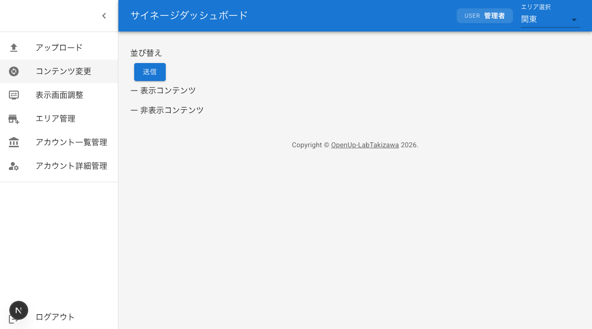

# コンテンツ管理

アップロード済みコンテンツの表示順序の並び替え、表示/非表示の切り替え、表示時間の変更、削除、および変更内容の送信方法を説明します。

## コンテンツ変更画面へのアクセス

1. ダッシュボードにログインする
2. サイドバーメニューの「コンテンツ変更」をクリックする
3. コンテンツ変更画面が表示される

画面上部のエリア選択ドロップダウンから、管理対象のエリアを選択してください。選択したエリアに登録されているコンテンツの一覧が表示されます。

## コンテンツの並び替え

ドラッグ＆ドロップ操作で、コンテンツの表示順序を変更できます。サイネージ画面では、ここで設定した順序でコンテンツがスライドショー表示されます。

1. 並び替えたいコンテンツをマウスでドラッグする
2. 移動先の位置までドラッグする
3. ドロップして順序を確定する

並び替え後、変更を反映するには「送信」ボタンをクリックしてください。

## 表示コンテンツと非表示コンテンツの切り替え

チェックボックスを使用して、各コンテンツの表示/非表示を切り替えます。非表示に設定したコンテンツは、サイネージ画面のスライドショーに表示されなくなります。

1. 切り替えたいコンテンツのチェックボックスを確認する
2. チェックボックスをオンにすると、そのコンテンツが表示対象になる
3. チェックボックスをオフにすると、そのコンテンツが非表示になる

コンテンツを削除せずに一時的に非表示にしたい場合に便利です。

## 表示時間の変更

### 画像コンテンツの表示時間

画像コンテンツの表示時間（秒）を手動で変更できます。設定した秒数の間、サイネージ画面にその画像が表示されます。

1. 表示時間を変更したい画像コンテンツの表示時間入力欄を確認する
2. 表示時間（秒）を入力する
3. 変更を反映するには「送信」ボタンをクリックする

### 動画コンテンツの表示時間

動画コンテンツの表示時間は、動画の長さに基づいて自動的に設定されます。手動での変更はできません。

動画の再生時間がそのまま表示時間として使用されるため、動画の長さを調整したい場合は、動画ファイル自体を編集してから再度アップロードしてください。

## コンテンツの削除

不要なコンテンツを削除できます。削除したコンテンツは元に戻せないため、慎重に操作してください。

1. 削除したいコンテンツの×ボタンをクリックする
2. コンテンツが一覧から削除される
3. 変更を反映するには「送信」ボタンをクリックする

## 変更内容の送信

並び替え、表示/非表示の切り替え、表示時間の変更、削除などの操作を行った後、変更内容をサーバーに反映するには「送信」ボタンをクリックします。

1. すべての変更操作を完了する
2. 画面の「送信」ボタンをクリックする
3. 変更内容がサーバーに送信され、サイネージ画面に反映される

「送信」ボタンをクリックするまで、変更内容はサーバーに反映されません。操作を終えたら必ず「送信」ボタンをクリックしてください。
