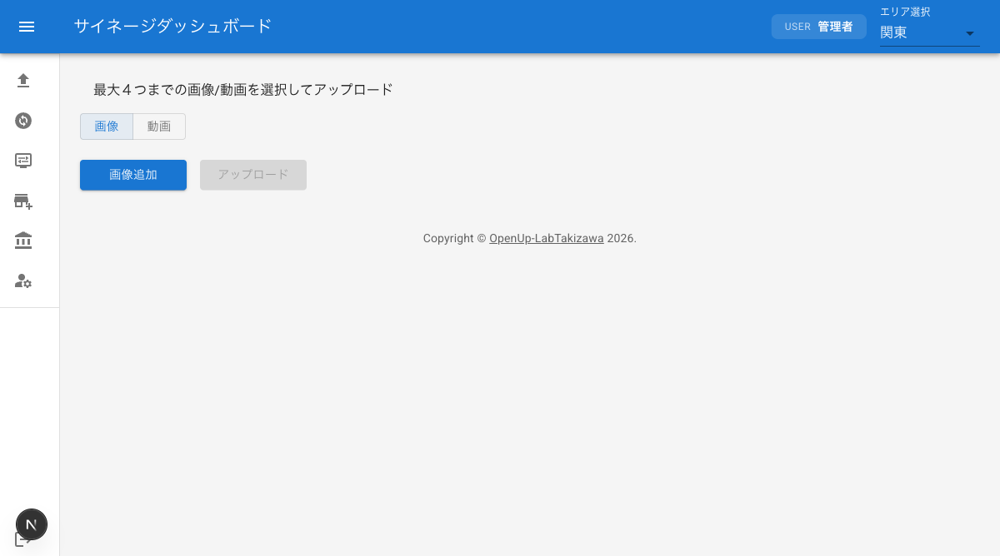

# コンテンツアップロード

サイネージに表示する画像や動画をアップロードする手順を説明します。対応ファイル形式やファイル数の制限、プレビュー確認方法、エラー発生時の対処方法についても記載しています。

## アップロード画面へのアクセス

1. ダッシュボードにログインする
2. サイドバーメニューの「アップロード」をクリックする
3. アップロード画面が表示される

## エリア選択

アップロード先のエリアを選択します。コンテンツはエリアごとに管理されるため、正しいエリアを選択してください。

1. アップロード画面上部のエリア選択ドロップダウンをクリックする
2. 表示されるエリア一覧から、アップロード先のエリアを選択する
3. 選択したエリアがドロップダウンに表示されていることを確認する

## 画像と動画の切り替え

アップロード画面では、トグルボタンで画像アップロードと動画アップロードを切り替えます。

- **画像モード**: 画像ファイル（PNG/JPEG）をアップロードする場合に選択する
- **動画モード**: 動画ファイル（MP4/MOV/WMV）をアップロードする場合に選択する

トグルボタンをクリックするたびに、画像モードと動画モードが切り替わります。

## 画像アップロードの手順

PNG または JPEG 形式の画像ファイルをアップロードします。一度に最大 4 ファイルまで選択できます。

1. トグルボタンで画像モードが選択されていることを確認する
2. ファイル選択エリアをクリックする、またはファイルをドラッグ＆ドロップする
3. アップロードする画像ファイルを選択する（最大 4 ファイル）
4. 選択した画像のプレビューが表示されることを確認する
5. 「アップロード」ボタンをクリックする
6. アップロードが完了する

**対応形式**: PNG、JPEG

**ファイル数上限**: 最大 4 ファイル

## 動画アップロードの手順

MP4、MOV、または WMV 形式の動画ファイルをアップロードします。一度に最大 4 ファイルまで選択できます。

1. トグルボタンで動画モードに切り替える
2. ファイル選択エリアをクリックする、またはファイルをドラッグ＆ドロップする
3. アップロードする動画ファイルを選択する（最大 4 ファイル）
4. 選択した動画のプレビューが表示されることを確認する
5. 「アップロード」ボタンをクリックする
6. アップロードが完了する

**対応形式**: MP4、MOV、WMV

**ファイル数上限**: 最大 4 ファイル

## アップロード前のプレビュー確認

ファイルを選択すると、アップロード前にプレビューが表示されます。プレビューで内容を確認してからアップロードしてください。

- **画像ファイル**: 選択した画像のサムネイルが表示される
- **動画ファイル**: 選択した動画のプレビューが表示される

プレビューを確認し、意図したファイルが選択されていることを確かめてから「アップロード」ボタンをクリックしてください。

## アップロード前にファイルを削除する

ファイル選択後、アップロード前に不要なファイルを取り除くことができます。

1. プレビュー表示されているファイルの中から、削除したいファイルを確認する
2. 対象ファイルの削除ボタン（×ボタン）をクリックする
3. ファイルがプレビュー一覧から削除される

必要に応じて、ファイルを追加で選択し直すこともできます。

## エラーメッセージと対処方法

### サポート対象外のファイル形式を選択した場合

対応していないファイル形式を選択すると、エラーメッセージが表示されます。

**対処方法**:

- 画像モードの場合は PNG または JPEG 形式のファイルを選択し直してください
- 動画モードの場合は MP4、MOV、または WMV 形式のファイルを選択し直してください
- ファイルの拡張子が正しいか確認してください
