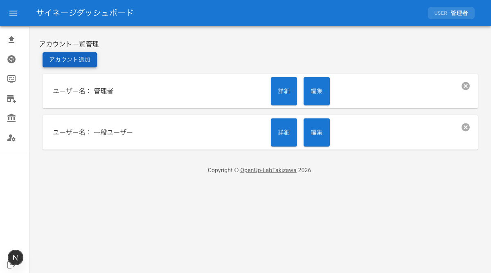
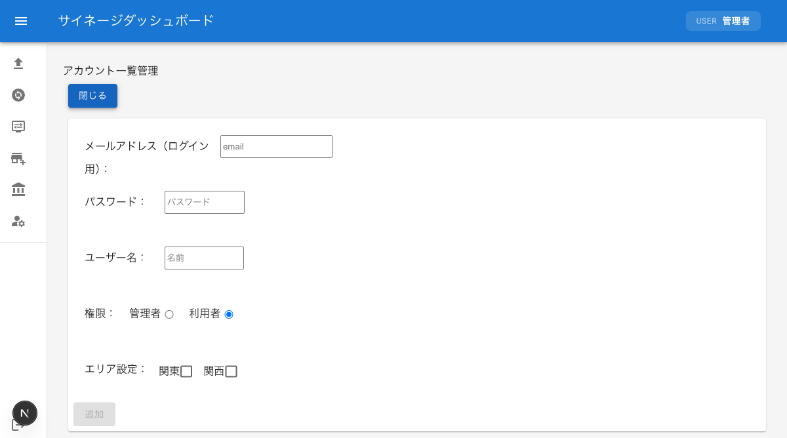

# アカウント一覧管理

ユーザーアカウントの作成・編集・削除方法を説明します。アカウント一覧管理は管理者のみが利用できる機能です。

:::tip
アカウント一覧管理メニューは管理者権限を持つユーザーにのみ表示されます。メニューが表示されない場合は、管理者にお問い合わせください。
:::

## アカウント一覧管理画面へのアクセス

1. ダッシュボードにログインする
2. サイドバーメニューの「アカウント一覧管理」をクリックする
3. アカウント一覧管理画面が表示され、登録済みのアカウント一覧が表示される

## 新規アカウントの作成

新しいアカウントを作成する手順です。

1. アカウント一覧管理画面の「アカウント追加」ボタンをクリックする
2. アカウント作成フォームが表示される
3. 以下の項目を入力する
   - **メールアドレス**: ログインに使用するメールアドレスを入力する
   - **パスワード**: ログインに使用するパスワードを入力する
   - **ユーザー名**: 表示名として使用するユーザー名を入力する
   - **権限**: 「管理者」または「利用者」を選択する
   - **エリア設定**: アクセスを許可するエリアをチェックボックスで選択する
4. 入力内容を確認し、「追加」ボタンをクリックする
5. アカウントが作成される

### 権限設定について

アカウント作成時に設定する権限には以下の2種類があります。

| 権限 | 説明 |
| --- | --- |
| 管理者 | エリア管理・アカウント一覧管理を含むすべての機能を利用できる |
| 利用者 | コンテンツのアップロード・変更・表示調整など基本的な機能を利用できる |

管理者権限を持つユーザーは、サイドバーに「エリア管理」と「アカウント一覧管理」のメニューが追加で表示されます。

### エリア設定について

エリア設定では、アカウントがアクセスできるエリアを指定します。

1. エリア設定欄に登録済みのエリアがチェックボックスで一覧表示される
2. アクセスを許可するエリアのチェックボックスをオンにする
3. 複数のエリアを選択できる

## アカウント詳細の確認

登録済みアカウントの詳細情報を確認する手順です。

1. アカウント一覧から確認したいアカウントの「詳細」ボタンをクリックする
2. アカウントの詳細情報（メールアドレス、ユーザー名、権限、エリア設定）が表示される

## アカウント情報の編集

既存アカウントの情報を変更する手順です。

1. アカウント一覧から編集したいアカウントの「編集」ボタンをクリックする
2. 編集フォームが表示される
3. 以下の項目を変更できる
   - **ユーザー名**: 新しいユーザー名を入力する
   - **エリア設定**: チェックボックスでアクセスを許可するエリアを変更する
4. 変更内容を確認し、「編集」ボタンをクリックして変更を確定する

編集をキャンセルする場合は「閉じる」ボタンをクリックしてください。

## アカウントの削除

不要なアカウントを削除する手順です。削除したアカウントは元に戻せないため、慎重に操作してください。

1. 削除したいアカウントの×ボタンをクリックする
2. アカウントが削除される
