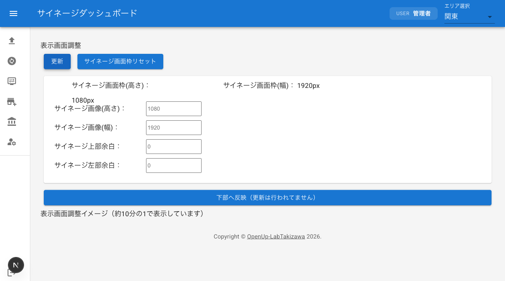

# 表示画面調整

Raspberry Pi に接続されたディスプレイ上でのコンテンツ表示位置やサイズの調整方法を説明します。各ディスプレイに合わせて画像の高さ・幅・余白を設定し、プレビューで確認してから更新できます。

## 表示画面調整画面へのアクセス

1. ダッシュボードにログインする
2. サイドバーメニューの「表示画面調整」をクリックする
3. 表示画面調整画面が表示される

画面上部のエリア選択ドロップダウンから、調整対象のエリアを選択してください。

## サイネージ表示画面枠の初期設定

表示画面調整画面に初めてアクセスした場合、またはサイネージ画面枠がリセットされている場合は、画面枠の初期設定が必要です。

1. 「サイネージ表示画面枠設定」の画面が表示される
2. 画面枠サイズのボタン（「大」など）をクリックする
3. サイネージ画面枠が設定され、画像サイズ・余白の調整画面に切り替わる

画面枠の設定が完了すると、サイネージ画面枠の高さ（px）と幅（px）が画面上部に表示されます。

## 画像の高さ・幅・上部余白・左部余白の調整

画面枠の設定後、以下の 4 つの項目を数値（ピクセル単位）で調整できます。

1. **サイネージ画像（高さ）** — 表示する画像の高さをピクセルで入力する
2. **サイネージ画像（幅）** — 表示する画像の幅をピクセルで入力する
3. **サイネージ上部余白** — 画面上端から画像までの余白をピクセルで入力する
4. **サイネージ左部余白** — 画面左端から画像までの余白をピクセルで入力する

各入力欄には現在の設定値がプレースホルダーとして表示されます。変更したい項目の入力欄に新しい値を入力してください。

## 調整内容のプレビュー確認

入力した値を実際の表示イメージで確認できます。プレビューは約 10 分の 1 スケールで表示されます。

1. 高さ・幅・余白の値を入力する
2. 「下部へ反映（更新は行われてません）」ボタンをクリックする
3. 画面下部に「表示画面調整イメージ（約10分の1で表示しています）」が表示される
4. 黒い背景がサイネージ画面枠、その中にコンテンツのプレビューが表示される

プレビューはあくまで確認用です。この時点ではまだサーバーへの更新は行われていません。

## 調整内容の更新

プレビューで確認した内容をサーバーに反映するには、「更新」ボタンを使用します。

1. 高さ・幅・余白の値が正しいことを確認する
2. 画面上部の「更新」ボタンをクリックする
3. 調整内容がサーバーに保存され、サイネージ画面に反映される

## サイネージ画面枠のリセット

サイネージ画面枠の設定をリセットして、初期状態に戻すことができます。

1. 「サイネージ画面枠リセット」ボタンをクリックする
2. 「ラズパイサイネージを起動することでサイネージ画面枠の値を再取得出来ます」というメッセージが表示される
3. Raspberry Pi でサイネージを起動すると、画面枠の値が再取得される

リセット後は、サイネージ表示画面枠の初期設定から再度行う必要があります。

## エラーメッセージと対処方法

### 画像サイズと余白の合計が画面枠サイズを超えた場合

画像の高さと上部余白の合計が画面枠の高さを超えている場合、または画像の幅と左部余白の合計が画面枠の幅を超えている場合、「更新」ボタンをクリックした際にエラーが表示されます。

**エラーメッセージ**: 「設定していサイズ（画像の縦と画像上部余白、もしくは画像の横と画像左部余白）が画面サイズ（CSSピクセルサイズ）を超えてます」

**対処方法**:

- 画像の高さと上部余白の合計が、サイネージ画面枠の高さ以下になるように値を調整してください
- 画像の幅と左部余白の合計が、サイネージ画面枠の幅以下になるように値を調整してください
- 画面上部に表示されているサイネージ画面枠のサイズ（px）を参考に、各値を設定してください
